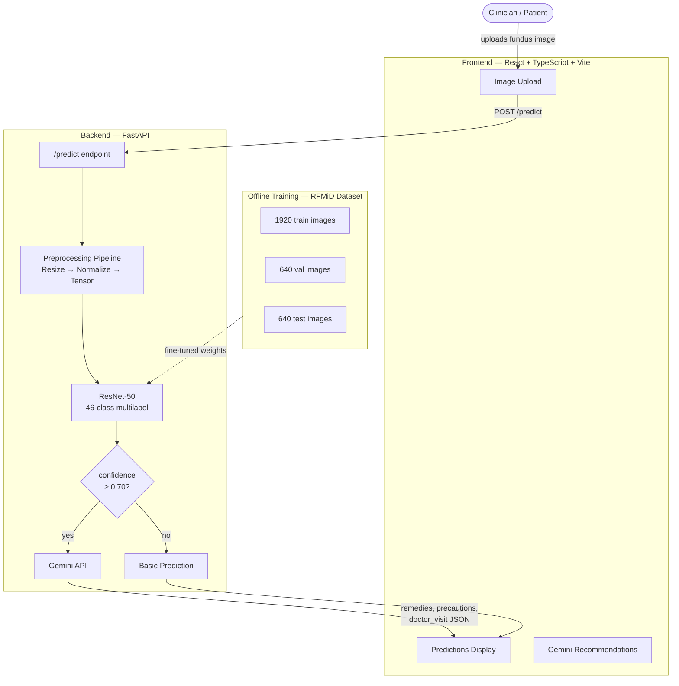

# OcuSight 👁️

A deep learning system for automated retinal disease detection from fundus images, with Gemini-powered clinical recommendations.

> **46 disease classes · BF16 mixed precision · 15ms inference · RTX 4060**

---

## 📄 Published Research

> **OcuSight: Benchmark Performance vs. Clinical Deployment Reliability in Retinal Multi-Disease Classification**

| Field | Details |
|---|---|
| Authors | Shiva Marath, Soubhik Sadhu, Adnan Nagdiwala, Vaddi Ranga Koushik |
| Journal | International Journal of Innovative Research in Technology (IJIRT) |
| ISSN | 2349-6002 |
| Volume / Issue | 12 / 12 |
| Pages | 2381–2390 |
| Published | May 2026 |
| Impact Factor | 8.412 (2026) |
| Paper ID | IJIRT200619 |
| Article URL | [ijirt.org/article?manuscript=200619](https://ijirt.org/article?manuscript=200619) |
| PDF | [Download Paper](https://ijirt.org/publishedpaper/IJIRT200619_PAPER.pdf) |

**Abstract:** Benchmarking statistics alone do not give clinicians confidence in automated retinal screening systems. This paper documents the development and iteration of OcuSight — a multi-label fundus disease classifier on the RFMiD dataset — comparing ResNet-50 and DenseNet-121 backbones across retinal fundus, brain MRI, and chest X-ray imaging. While DenseNet-121 outperformed ResNet-50 on controlled test sets (macro-F1: 0.2023 vs. 0.1769), real-world deployment revealed critical failure modes — misclassifying healthy retinas as pathological and vice versa. Investigation led to replacing DenseNet-121 with ResNet-50, which produced well-calibrated outputs (e.g., 86.11% pathology probability for confirmed abnormal fundus). Findings are supported by a comprehensive architectural comparison, a survey of all 51 RFMiD 2.0 disease categories, and Grad-CAM saliency analysis.

**Cite this paper:**
```
Marath, S., & Sadhu, S., & Nagdiwala, A., & Koushik, V. R. (2026). OcuSight: Benchmark Performance
vs. Clinical Deployment Reliability in Retinal Multi-Disease Classification.
International Journal of Innovative Research in Technology (IJIRT), 12(12), 2381–2390.
```

**BibTeX:**
```bibtex
@article{200619,
  author    = {Shiva Marath and Soubhik Sadhu and Adnan Nagdiwala and Vaddi Ranga Koushik},
  title     = {OcuSight: Benchmark Performance vs. Clinical Deployment Reliability in Retinal Multi-Disease Classification},
  journal   = {International Journal of Innovative Research in Technology},
  year      = {2026},
  volume    = {12},
  number    = {12},
  pages     = {2381--2390},
  issn      = {2349-6002},
  url       = {https://ijirt.org/article?manuscript=200619},
  month     = {May},
}
```

---

## Architecture



---

## Project Structure

```
OcuSight/
├── data/
│   └── rfmid/
│       ├── images/
│       │   ├── train/              # 1920 images
│       │   ├── val/                # 640 images
│       │   └── test/               # 640 images
│       └── labels/
│           ├── train_labels.csv
│           ├── val_labels.csv
│           └── test_labels.csv
├── Models/
│   └── ResNet50_Optimized_Training.ipynb
├── checkpoints/
│   └── best_resnet50.pth           # best val F1 checkpoint
├── outputs/                        # training curves, results JSON
├── frontend/                       # React + TS + Vite
├── backend/                        # FastAPI
├── .env
└── requirements.txt
```

---

## Stack

| Layer | Technology |
|---|---|
| Frontend | React 18, TypeScript, Vite, TailwindCSS |
| Backend | FastAPI (Python 3.10) |
| ML Framework | PyTorch 2.1 + CUDA 12.1 |
| Model | ResNet-50 (ImageNet pretrained) |
| Precision | BF16 mixed precision + TF32 |
| Explainability | Grad-CAM saliency maps |
| Recommendations | Gemini API → JSON |
| Environment | `.env` for secrets |

---

## Model

| Parameter | Value |
|---|---|
| Architecture | ResNet-50 |
| Task | Multilabel classification (sigmoid) |
| Classes | 46 retinal diseases |
| Loss | BCEWithLogitsLoss (weighted) |
| Optimizer | AdamW (lr=1e-3, weight decay=0.01) |
| Scheduler | CosineAnnealingLR (T_max=50, η_min=1e-6) |
| Batch Size | 32 |
| Epochs | 50 (early stopping, patience=10) |
| Precision | BF16 (RTX 4060 native) |
| Inference | ~15ms on RTX 4060 |

> **Why ResNet-50?** During development, DenseNet-121 achieved a higher macro-F1 (0.2023 vs. 0.1769) on controlled test sets, but produced clinically unacceptable false positive and false negative rates on real-world fundus images. ResNet-50 was selected for its well-calibrated, deployment-stable outputs. See the [published paper](https://ijirt.org/article?manuscript=200619) for the full architectural comparison and Grad-CAM analysis.

---

## Confidence-Based Gemini Integration

```python
if confidence >= 0.70:
    # High confidence → ask Gemini for clinical recommendations
    gemini_response = GeminiAPI.generate(prompt)
    return {**prediction, **gemini_response}
else:
    # Low confidence → return prediction only
    return {
        "prediction": disease,
        "confidence": confidence,
        "message": "Low confidence. Please consult an ophthalmologist."
    }
```

**Sample Gemini response:**

```json
{
  "remedies": [
    "Intravitreal anti-VEGF injections (Ranibizumab/Aflibercept)",
    "Focal laser photocoagulation for macular edema",
    "Strict glycemic control (HbA1c < 7%)"
  ],
  "precautions": [
    "Monitor blood glucose levels daily",
    "Annual dilated eye examinations",
    "Control blood pressure (<130/80 mmHg)"
  ],
  "doctor_visit": "Within 1 week for confirmatory OCT"
}
```

---

## API Endpoints

| Endpoint | Method | Description |
|---|---|---|
| `/predict` | POST | Upload image → diagnosis + recommendations |
| `/health` | GET | Service health check |
| `/model-info` | GET | Model metadata (classes, accuracy) |
| `/docs` | GET | Swagger UI |

**Sample request:**
```bash
curl -X POST http://localhost:8000/predict \
  -F "file=@retinal_scan.jpg"
```

---

## Setup

### 1. Clone & install

```bash
git clone https://github.com/your-username/ocusight.git
cd ocusight
pip install -r requirements.txt
```

### 2. Environment variables

```env
# backend .env
GEMINI_API_KEY=your_gemini_api_key
MODEL_PATH=./checkpoints/best_resnet50.pth
DEVICE=cuda
CONFIDENCE_THRESHOLD=0.70

# frontend .env
VITE_API_URL=http://localhost:8000
VITE_APP_NAME=OcuSight
```

### 3. Run backend

```bash
cd backend
uvicorn main:app --reload
```

### 4. Run frontend

```bash
cd frontend
npm install
npm run dev
```

---

## Training

Open `Models/ResNet50_Optimized_Training.ipynb` and run cells in order.
Best checkpoint is saved automatically to `checkpoints/best_resnet50.pth`.

Hardware used: HP Omen 16 — RTX 4060 (8GB), i7-13700HX

---

## Dataset — RFMiD

3,200 high-resolution fundus photographs across 46 annotated disease classes.  
Split: 1920 train / 640 val / 640 test.  
Available on [IEEE DataPort](https://ieee-dataport.org) and [Kaggle](https://kaggle.com).
